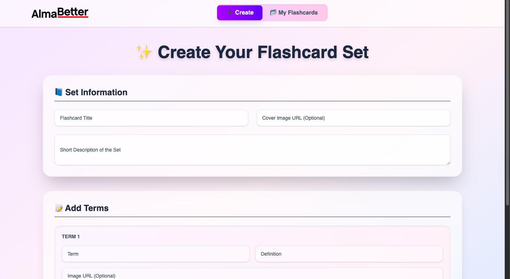
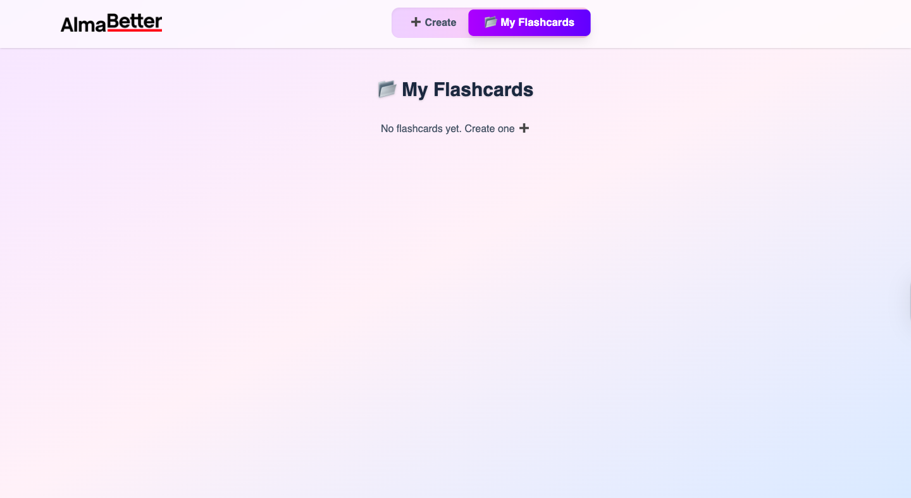

🃏 Flashcard App

A modern and interactive Flashcard App built with React.
It allows users to create, view, share, and delete flashcards effortlessly.
Designed with a sleek UI, this app makes learning and revision fun.
Easily share flashcards via WhatsApp and other platforms.

🚀 Features

➕ Create Flashcards with custom content

📂 Manage Flashcards in "My Flashcards" tab

👀 View flashcards in detail

📤 Share cards directly with friends

🗑️ Delete unwanted flashcards anytime

🎨 Responsive Tailwind CSS UI for smooth experience

📸 Screenshots
✨ Create Cards Page

📂 My Cards Page

🛠️ Tech Stack

⚛️ React – Frontend framework

🎨 Tailwind CSS – Styling and UI

🌐 Vite – Development and build tool

📖 About

This project is a personal learning app to practice React + Tailwind CSS while creating something useful for quick learning and revision.
Flashcards can be created, managed, shared, and deleted in a clean, intuitive interface.

🌟 Future Enhancements

🔑 User authentication & profiles

☁️ Cloud storage for flashcards

📱 PWA support for offline use

🤝 Contributing

Contributions are welcome!
Feel free to fork this repo, create a branch, and submit a pull request.

📜 License

This project is licensed under the MIT License – you are free to use, modify, and share.
